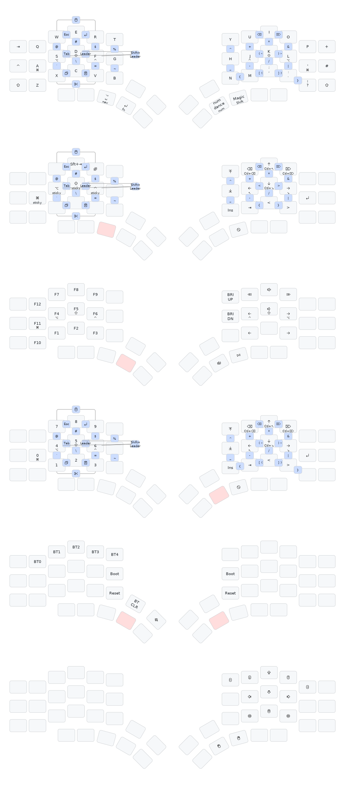

# Wireless ZMK Kyria from splitkb.com

Documentation and software/firmware for my wireless split keyboard:
[SplitKB Kyria revision 3](https://splitkb.com/products/kyria-rev3).

I am using [ZMK Firmware](https://zmk.dev/). The keyboard layout is based on
https://github.com/urob/zmk-config, with a boring QWERTY keymap for easy
transitions to traditional keyboards.

## Keymap

## Selection criteria for my keyboard

* Very low profile
* Very quiet
* Columnar stagger, moderate or aggressive
* Two-halfs split
* USB-C wired connection
* Bluetooth wireless connection
* USB-C charging with reasonably long battery life
* Most parts available from a single shop in Europe

https://compare.splitkb.com/

The [ZSA Voyager](https://www.zsa.io/voyager) would fit well but is wired-only.
It shipps from Taiwan and costs nearly twice compated to the DIY SplitKB Kyria.

The [Naya Create](https://naya.tech/products/naya-create) would fit very well.
It is not available yet (May 2024), and even more expansive than the ZSA Voyager.
